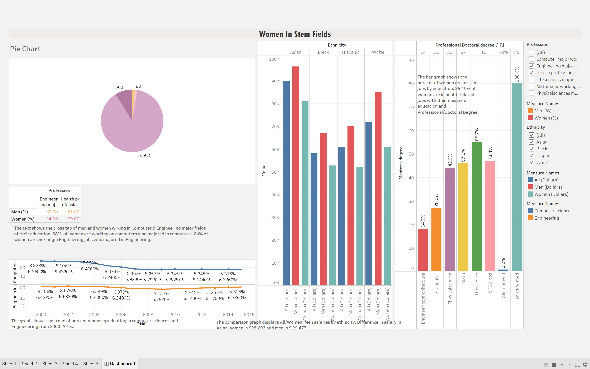

# WomeninStemFields

## Introduction-
This dashboard empowers mission driven organizations to harness the power of data visualization for social change. Women are tracked away from science and mathematics throughout their education, limiting their training and options to go into these fields as adults. The data set contains the data of women graduated by years, employed persons, Stem Jobs by Education add Salary comparison. This dashboard addresses some major gaps between Men and Women in STEM (Science, Technology, Engineering & Mathematics) fields.

## General Requirements-
The dashboard should look like an article predicting the basic issues.

## Business Requirements
Title: Women in STEM Fields.

-A pie graph of women in
Biological Scientists
Chemists & Materials Scientists
Computer & Mathematical Occupations
Engineers & Architects

-The trend of percent women graduating in Computer science and Engineering from 2000-2015

Should be in text after the graph. Frame a sentence.
What percent of women are graduating from stem majors (Computer science and Engineering) by 2015

-A bar graph of what percent of women are in stem jobs by education in which field.

Should be in text after the graph. Frame a sentence.
What percent of women are in health-related jobs with their master’s education and Professional/Doctoral Degree?

-Show a cross tab of men and women working in the related fields of their education.

Should be in text after the graph. Frame a sentence.
What percent of women are working in computers who majored in Computers?
What percent of women are working in Engineering jobs who majored in Engineering?

-A comparison graph of All/Men/Women Salaries by ethnicity.

Should be in text after the graph. Frame a sentence.
What is the difference in salary in Asian women and men?

-Please write a detailed insight on what can be the possible issues on gender gap in STEM Jobs.
